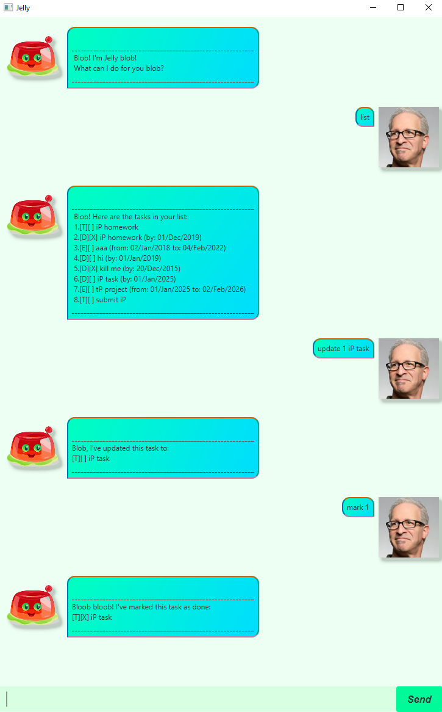

# Jelly User Guide


Jelly tasklist


## Adding deadlines
Add deadline tasks

### Usage: 
`deadline <description> /by <dd/MMM/yyyy>`

### Example: 
`deadline iP task /by 01/Jan/2025`

### Expected Output:
```
Blob. I've added this task:
[D][] iP task (by: 01/Jan/2025)
Now you have 1 task in the list blob.
```

## Adding events
Add event tasks

### Usage:
`event <description> /from <dd/MMM/yyyy> /to <dd/MMM/yyyy>`

### Example:
`event tP project /from 01/Jan/2025 /to 02/Feb/2026`

### Expected Output:
```
Blob. I've added this task:
[D][] tP project (from: 01/Jan/2025 to: 02/Feb/2026)
Now you have 2 task in the list blob.
```

## Adding todos
Add todo tasks

### Usage:
`todo <description>`

### Example:
`todo submit iP`

### Expected Output:
```
Blob. I've added this task:
[D][] submit iP
Now you have 3 task in the list blob.
```

## Listing all tasks
List all existing tasks

### Usage:
`list`

### Example:
`list`

### Expected Output:
```
Blob! Here are the tasks in your list:
1. [D][] iP task (by: 01/Jan/2025)
2. [D][] tP project (from: 01/Jan/2025 to: 02/Feb/2026)
3. [D][] submit iP
```

## Marking tasks
Mark an existing task

### Usage:
`mark <task number>`

### Example:
`mark 1`

### Expected Output:
```
Bloob bloob! I've marked this task as done:
[D][X] iP task (by: 01/Jan/2025)
```

## Unmarking tasks
Unmark an existing task

### Usage:
`unmark <task number>`

### Example:
`unmark 1`

### Expected Output:
```
Blob..., I've marked this task as not done yet:
[D][] iP task (by: 01/Jan/2025)
```

## Updating tasks
Update description of an existing task

### Usage:
`update <task number> <description>`

### Example:
`update 1 iP homework`

### Expected Output:
```
Blob, I've updated this task to:
[T][] iP homework (by: 01/Jan/2025)
```

## Deleting tasks
Delete an existing task

### Usage:
`delete <task number>`

### Example:
`delete 1`

### Expected Output:
```
Blob blob. I've removed this task:
[D][] iP homework (by: 01/Jan/2025)
Now you have 2 task in the list blob.
```